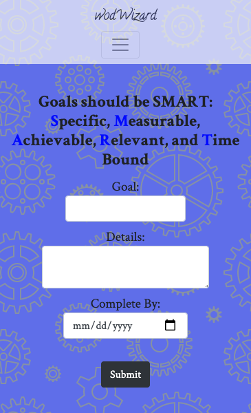
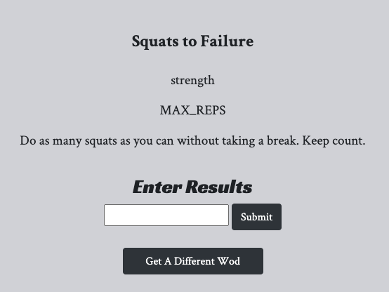
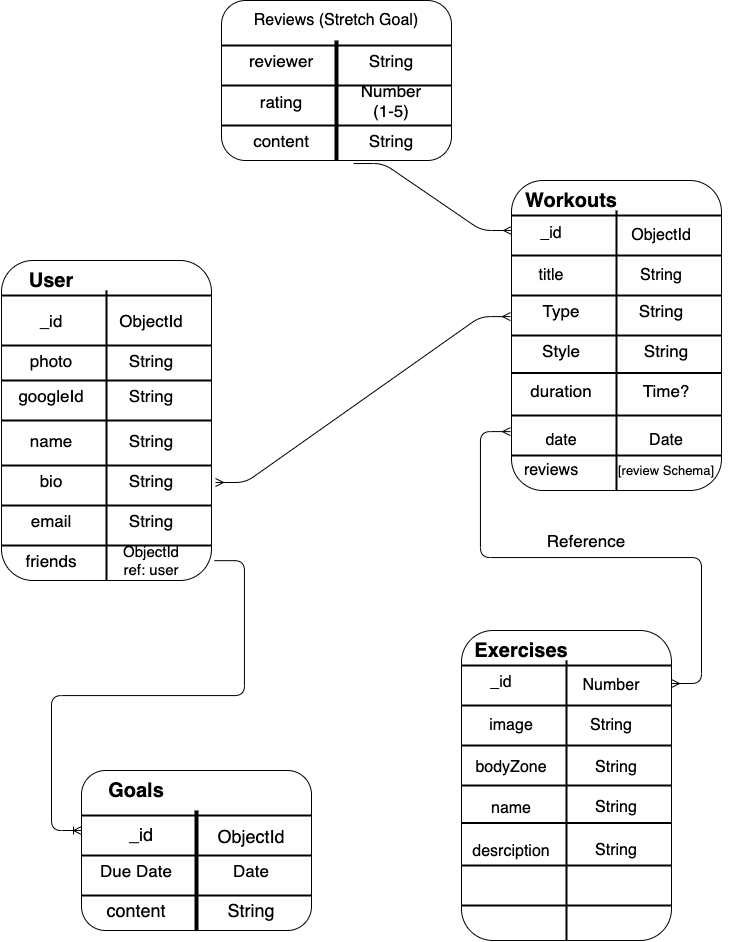

# wodWizard
[Open](https://wodwizard.herokuapp.com/)

## Contents:
* Objective
* Motivation
* Minimum Viable Product
* Screenshots
* Wireframes
* Stretch Goals
* Technologies Implemented
* Credits

### Objective
To create a straighforward app to track workout progressions in speed as well as increased weight and reps.

### Motivation
Due to Covid19, my very active 70+ father is no longer going to the gym. He laments the loss of the weight machines where he was easily able to keep track of his gains in strength and increased weight. I hope this will give him and others the ability to see gains in their workouts.

### Minimum Viable Product:
* AAU I should be able login/logout using google OAuth.
* AAU I should be able to see exercises, typical workouts, and example charts without logging in.
* AAU I should be able to add friends.
* AAU I should be able to set goals.
* AAU I should be able to add workouts.
* AAU I should be able to see a daily workout.
* AAU I should be able to see previous workouts.
* AAU I should see a calendar to keep track of workouts.
* AAU I should have updatable basic info/baseline stats including 1 mile run, 2k erg, and reps to failure of pullups/pushups/squats.
* AAU I should see charts of baseline stats progressions.

### Screenshots

### Wireframes/ERD:

Original ER Diagram

Wireframe of entry and add workout pages

Wireframe of goals and stats pages

### Stretch Goals:
* AAU I should be able to see charts of progress over time of a workout/movement.
* User should see some sort of excitement when a goal is reached
* User should be able to send motivational text/emojis to friends
* User should be able to send workouts to friends
* User should be able to favorite workouts
* User should be able to have check-ins on baseline workouts at some interval
* User should get check-ins on favorited workouts on some interval
* User should be able to start a timer in app that corresponds with the selected workout
* User should be able to login with Fitbit and see authorized info from that API
* User should have a percentage calculator for weighted workouts
* * AAU I should be able to select exercises from a dropdown menu to populate my workout.

### Technologies Implemented:
* HTML
* CSS
* Javascript
* Express
* Node.js
* Bootstrap

### Credits
* Missy Morgan: gave several workouts.
* There are 2 Crossfit workouts listed. They belong to Crossift.

#### Open App
[Here](https://wodwizard.herokuapp.com/)
